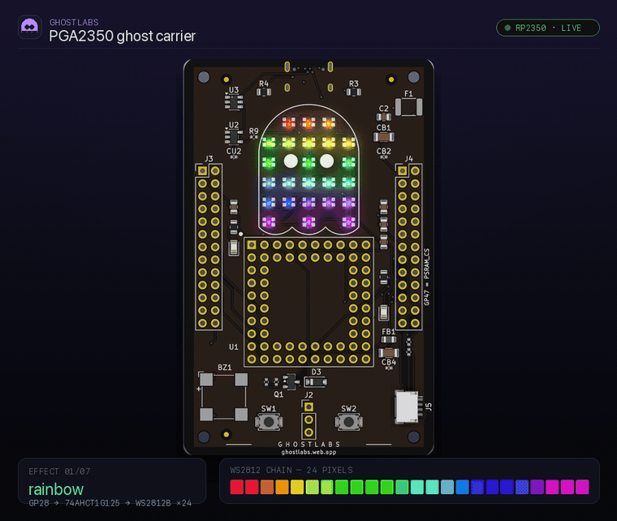
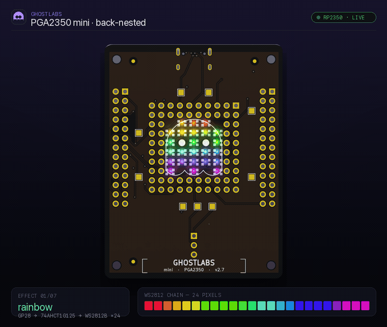

[](../../actions/workflows/ci.yml)
[](#quick-start)
[](./LICENSE)
[](./package.json)
[](#layout)
[](#whats-emulated)
[](./CONTRIBUTING.md)

# GhLabs RP2350 emulator (`rp2350js`)

A pure-software, instruction-by-instruction emulator of the **RP2350** (Raspberry Pi Pico 2) and its
dual **Hazard3 RISC-V** cores — plus the original **RP2040** (Arm Cortex-M0+) it descends from. Two
chips live behind one interface: it boots the RP2350 A2 bootrom, brings up both RISC-V cores, and runs
real firmware down to the individual WS2812 bit, with **no hardware in the loop**.

<table>
  <tr>
    <td align="center" width="50%">
      
      <br><sub><b>PGA2350 carrier</b> · main</sub>
    </td>
    <td align="center" width="50%">
      
      <br><sub><b>PGA2350 carrier</b> · mini</sub>
    </td>
  </tr>
</table>

*This isn't a demo reel — it's a readout. The light show is the **`ghostshow`** firmware's
[`effects.c`](https://github.com/GhostRoboticsLab/CustomPCB_ghost/tree/main/pga2350-carrier/firmware/ghostshow),
and every WS2812 bit that drives it is produced by this engine stepping the Hazard3 cores through the
RP2350 bootrom, SIO, timers, PIO, and — in the dual-core build — a second core computing the plasma
field. The boards are the [GhostLabs PGA2350 carriers](https://github.com/GhostRoboticsLab/CustomPCB_ghost)
this emulator was built to bring up.*

> **Status: early but real, and now dual-core.** The RISC-V cores boot and run RV32IMAC +
> Zba/Zbb/Zbs/Zcb code and pass a verified instruction-correctness suite. The RP2350 peripheral layer
> is multi-chip parameterized (`tsc` is clean), the chip boots its A2 bootrom, and **both cores** come
> up through a faithful `multicore_launch_core1` PSM/FIFO handshake. All firmware-integration gates
> pass — **`blink_simple`** (GPIO via SIO), **`hello_timer`** (a 250M-step timer-IRQ run), **`pio_blink`**
> (two PIO blocks driving GPIO3 and GPIO32 through the GPIOBASE pin-window), and the **`ghostshow`**
> carrier twin in both single- and dual-core builds. **All 409 tests pass, none skipped.** See
> **[ROADMAP.md](./ROADMAP.md)** for the defect log and deferred work, and
> [Known boundaries](#known-boundaries--dont-mistake-green-for-silicon) for what is deliberately *not*
> modelled.

## Why a digital twin

The point of a digital twin is to fail in software, not silicon. This engine is the brain inside the
[PGA2350 carrier](https://github.com/GhostRoboticsLab/CustomPCB_ghost)'s simulation: the firmware boots
here — A2 bootrom → Hazard3 cores → the WS2812 chain on GP28 — long before a board is reflowed, so a
wrong `MUL`, a dropped timer IRQ, a mis-based PIO pin-window, or a botched core-1 launch surfaces as a
**red test**, not a dead pixel on a soldered-down module. A Vite + TypeScript dashboard in the carrier
repo drives this engine headless, reconstructs the GP28 bitstream into 24 live pixels, and plays exactly
the show above in a browser. Same firmware binary, same instruction cores — emulated here, reflowed
there.

## What's emulated

Two chips implement one `IRPChip` interface; every peripheral depends on the interface, not the concrete
chip, so a single parameterized class usually serves both.

| Layer | RP2350 (Hazard3 RISC-V) | RP2040 (Arm Cortex-M0+) |
|---|---|---|
| **CPU** | **Dual** Hazard3 cores, RV32IMAC + Zba/Zbb/Zbs/Zcb; full RV32A atomics (all AMOs + LR/SC with a per-core reservation); `wfi`; `mcycle`/`minstret`/`cycle`/`instret` CSRs | Single Cortex-M0+ Thumb core (upstream) |
| **Boot** | A2 bootrom; **PSM/FIFO `multicore_launch_core1`** handshake brings core1 up faithfully | — |
| **Memory map** | FLASH `0x10000000` · SRAM `0x20000000` · APB `0x40000000` · USB DPRAM `0x50100000` · SIO `0xd0000000`; 8/16-bit register writes replicated, atomic set/clr/xor aliases | RP2040 map (upstream) |
| **SIO** | Inter-core FIFOs, spinlocks, **DOORBELL + SIO_IRQ_BELL**, FIFO_ST write-1-to-clear | upstream |
| **PIO** | 3 blocks, **fractional CLKDIV + per-instruction delay slots**, GPIOBASE 32-pin window (GPIO16..47), 32-bit pad mask | 2 blocks (upstream) |
| **Timers / IRQ** | RP2350 TIMER IRQ base + INTR/INTE/INTF/INTS offsets, Xh3irq external-IRQ delivery | upstream |
| **PWM** | 12 slices, corrected EN read-back | 8 slices (upstream) |
| **Watchdog** | 1 MHz tick + working SCRATCH registers | 2 MHz (RP2040-E1) |
| **Power / timekeeping** | POWMAN 64-bit always-on timer (free-running) + 0x5afe write-password; TICKS tick generators | — |
| **Security / OTP** | OTP fuse array + guarded ECC read window; **real SHA-256** (FIPS 180-4 tested); seeded TRNG; benign glitch detector; ACCESSCTRL + PMP CSR state (stored, unenforced) | — |
| **DMA / UART / SPI / I²C / ADC / USB** | chip-aware IRQ/DREQ ids, DREQ-driven pacing | upstream |
| **Tooling** | `start:rp2350` CLI runner; family-id-aware UF2 loader (routes flash vs SRAM, **rejects Arm images loudly**) | `npm start` demo + GDB server |

### Dual-core

By default both RISC-V cores run from reset. For faithful SDK bring-up, call
`rp2350.holdCore1ForLaunch()`: core1 parks in the bootrom wait-loop and comes up only when core0's
`multicore_launch_core1` drives the real cross-wired SIO FIFO handshake
(`{0, 0, 1, vector_table, sp, entry}`, with echo/resync), at which point the engine sets core1's PC,
SP, and MTVEC and releases it. The dual-core `ghostshow` twin uses this to run the FPU plasma field on
core1 while core0 renders — verified headless in [`src/ghostshow.spec.ts`](./src/ghostshow.spec.ts) and
live in the browser twin.

## Correctness: how the core was hardened

The imported RISC-V core was an honest WIP. An adversarial spec review (7 ISA-area reviewers, each
finding independently verified) surfaced **19 confirmed defects**; every one is fixed with a falsifiable
test — **red on the pre-fix engine, green after** (the "signature rule", see
[CONTRIBUTING.md](./CONTRIBUTING.md)).

- **The whole RV32M multiply family.** `MUL` used JavaScript's float64 `*`, silently wrong for any
  product above 2⁵³ (~95% of random operands); `MULH`/`MULHU` lost precision; **`MULHSU` was undecoded
  and crashed the core.** Now exact via `Math.imul` / `BigInt`.
- **Synchronous trap entry.** `ECALL`/`EBREAK` skipped the handler's first instruction (landed at
  `mtvec + ilen`) — would break a FreeRTOS `portYIELD`. Fixed.
- **Hazard3 external IRQ 0** (TIMER0_IRQ_0) was never delivered (NOIRQ tested via `irq==0` instead of
  the `meinext` sign bit). Fixed.
- `SLTIU` immediate sign-extension, `JALR` LSB masking, `CSRRC` write gating, warm-reset PC, the
  trap-entry `mstatus` update, and the **Zcb** compressed instructions the RP2350 bootrom needs.

Two further trap bugs were found by **lockstepping this engine against the reference** and bisecting the
first architectural divergence — these are what make a full firmware run work, not just the unit suite:

- **`MEINEXT` reset value.** It must reset to NOIRQ; a zeroed `MEINEXT` reads as "IRQ 0 pending", so the
  IRQ-0 gate above took a *phantom* IRQ 0 the instant firmware enabled interrupts. (This was the
  `hello_timer` stall.)
- **MTVEC mode bits.** Trap targets must mask `mtvec[1:0]`; a vectored mtvec (RP2350 firmware sets
  `0x20000001`) otherwise sends an exception to an odd address and crashes. (This was the `pio_blink`
  crash.)

A subsequent **realism pass**, gated by the real `ghostshow` carrier firmware, added the fractional PIO
clocking, full atomics, `wfi`, the counter CSRs, `rol`/`ror`/`binv`/`orc.b`, the SIO doorbell, the
watchdog, the 12-slice PWM, the CLI + UF2 loader, and the dual-core launch above — the changes that turn
"decodes but wrong" into a ghost that renders in colour instead of all-black.

Regression tests live in [`src/riscv/test/cpu-fixes.spec.ts`](./src/riscv/test/cpu-fixes.spec.ts)
(unit-level) and [`src/rp2350.spec.ts`](./src/rp2350.spec.ts) / [`src/ghostshow.spec.ts`](./src/ghostshow.spec.ts)
(firmware-integration). The illegal-instruction `throw` is kept deliberately as a debug aid rather than
silently trapping `mcause=2`.

## Known boundaries — don't mistake green for silicon

- **No Arm Cortex-M33 path.** This engine emulates the two Hazard3 RISC-V cores; the SDK's default
  target `rp2350-arm-s` cannot run here (the RP2040 M0+ core is not reusable). The UF2 loader flags such
  images.
- **`clk_sys` is a fixed rate**, not PLL-driven; the RP2350 SDK default is 150 MHz. Absolute peripheral
  rates are approximate until per-firmware PLL-driven clocking lands (deferred to avoid shifting the
  `hello_timer` gate).
- **Cold-boot ROM sequence is bypassed** — PC is set to the image entry rather than run through the
  bootrom's image-parse/secure-boot. OTP and TICKS registers read back faithfully, but nothing *gates*
  on them: secure-boot isn't enforced and the timers free-run rather than being clocked by TICKS.
  (Core1 *launch* itself **is** modelled.)
- **State without enforcement.** M/U privilege, PMP, and ACCESSCTRL are stored and read back correctly,
  but no access faults are raised — enforcement is deferred behind a fault-injection harness.
- **Dual-core stepping is core0-favoured quantised lockstep** — a green multicore test does **not**
  prove race-freedom.

## Quick start

```bash
npm install                          # Node >= 18
npm test                             # 409 pass, 0 skipped. hello_timer ~22s (a 250M-step firmware run)

npx vitest run src/riscv             # RISC-V instruction-correctness suite only
npx vitest run src/rp2350.spec.ts    # RP2350 firmware integration tests only
npx tsc --noEmit                     # type-check — must stay clean

npm run start:rp2350 -- --image f.uf2   # boot a .uf2/.hex on the RISC-V core, stream UART, --pin N counts GPIO edges
npm start                               # RP2040 (Arm) demo runner — NOT RP2350
```

## Layout

- **`src/riscv/`** — the Hazard3 RISC-V CPU (`cpu.ts`, dual-core), the RV32C decompressor (`rv32c.ts`),
  a test-only RISC-V assembler, and the correctness tests.
- **`src/rp2350.ts`, `src/rpchip.ts`, `src/*_rp2350.ts`, `src/peripherals/*_rp2350.ts`** — the RP2350
  chip and its RP2350-specific peripheral variants.
- **everything else in `src/` and `src/peripherals/`** — the RP2040 (Arm) base, parameterized to serve
  both chips where practical.
- **`demo/`** — bootrom image, CLI runners, UF2 loader, and the vendored `ghostshow` firmware fixtures.

See [CLAUDE.md](./CLAUDE.md) for the architecture in depth (the two stepping models, the file-naming
convention, and the firmware-run harness pattern).

## Lineage & credit

This is now a **standalone project**, but it stands on three links of a chain — all MIT, all credited
(see **[CREDITS.md](./CREDITS.md)**):

1. **[wokwi/rp2040js](https://github.com/wokwi/rp2040js)** (Uri Shaked) — the RP2040 emulator base.
2. **[c1570/rp2040js](https://github.com/c1570/rp2040js)** (`rp2350js/WIP`) — added the entire
   RP2350 / Hazard3 RISC-V core (~50 h). Imported here with authorship preserved.
3. **This project** — re-bases c1570's RP2350 work onto the latest upstream, corrects and test-gates the
   RISC-V core, parameterizes the peripheral layer for multi-chip, and adds the dual-core launch and
   realism pass above.

It began as a fork and has been spun off into its own repository as upstream RP2350 work stalled;
peripheral-parameterization and core fixes are still offered back upstream as small, reviewable PRs
where they apply cleanly to the RP2040 base.

## Contributing

Short imperative commit subjects; **DCO sign-off required** (`git commit -s`); **no co-author trailers**;
one concern per PR. Every behavioral fix ships a negative-control test (red before, green after). See
**[CONTRIBUTING.md](./CONTRIBUTING.md)**.

## License

MIT — see [LICENSE](./LICENSE) and [CREDITS.md](./CREDITS.md).
